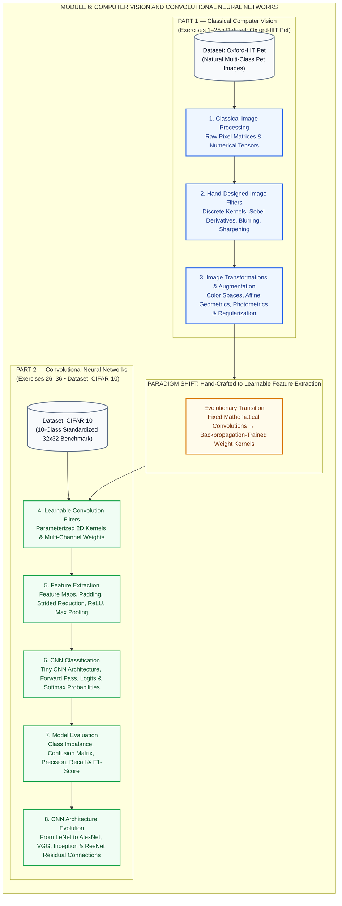

<div align="center">

# Module 6 - Computer Vision and CNN

### Practical Image Processing, Data Augmentation, and Convolutional Neural Network Foundations

[](https://www.python.org/)
[](https://pytorch.org/)
[](https://pytorch.org/vision/stable/)
[](https://opencv.org/)
[](https://numpy.org/)
[](https://scikit-learn.org/)
[](https://jupyter.org/)

</div>

---

## Project Overview

This repository contains the practical assignments for **Module 6**, presenting a comprehensive, end-to-end curriculum bridging traditional computer vision fundamentals with modern deep Convolutional Neural Networks (CNNs).

The curriculum is engineered around a foundational conceptual paradigm: **modern deep learning does not discard classical computer vision—it parameterizes and automates it.** Where classical vision relies on mathematicians and engineers to hand-craft static spatial kernels for edge isolation, smoothing, and texture extraction, convolutional neural networks instantiate learnable weight tensors optimized directly on visual loss functions via backpropagation.

Across **36 distinct practical exercises**, this repository systematically guides practitioners through this conceptual and mathematical evolution:
1. Understanding digital images as discrete multidimensional numerical matrices.
2. Formulating spatial filtering kernels for edge detection, gradient analysis, and unsharp masking.
3. Decoupling luminance from chrominance across color spaces (RGB to HSV) for segmentation.
4. Building data augmentation pipelines enforcing geometric, photometric, and occlusion invariance.
5. Transitioning from fixed kernels to trainable 2D convolutional filter banks.
6. Governing feature dimensions and receptive fields via padding, stride, ReLU, and max pooling.
7. Assembling a full feedforward CNN classifier ("Tiny CNN") from first principles.
8. Evaluating classification systems beyond naive accuracy using confusion matrices, precision, recall, and F1-score on skewed class distributions.
9. Tracing historical architectural milestones from early convnets to deep residual networks.

---

## Repository Structure

```text
Computer-Vision-FWC/
├── Oxford_IIIT_Pet.ipynb   # Part 1: Classical CV & Data Augmentation (Exercises 1–25)
├── CIFAR10.ipynb           # Part 2: CNN Fundamentals & Model Evaluation (Exercises 26–36)
└── README.md               # Visual repository documentation & technical syllabus
```

### Notebook Assignments

* **`Oxford_IIIT_Pet.ipynb` (Exercises 1–25)**:
  * **Dataset**: Oxford-IIIT Pet (37 breeds of cats and dogs, high-resolution natural images).
  * **Scope**: Pixel tensor analysis, hand-designed spatial convolution kernels, Sobel/Canny edge detection, HSV color segmentation, affine geometric transforms, photometric color jittering, cutouts/occlusion, and composite augmentation policy design.
* **`CIFAR10.ipynb` (Exercises 26–36)**:
  * **Dataset**: CIFAR-10 (60,000 $32 \times 32 \times 3$ images across 10 natural classes).
  * **Scope**: Parameterized `nn.Conv2d` layers, feature map extraction, spatial dimension math ($W_{\text{out}}$), padding, stride, non-linear activations (ReLU), spatial downsampling (Max Pooling), Tiny CNN assembly, logit and softmax probability forward passes, confusion matrix analytics, and the architectural lineage of deep networks.

> **Note**: Datasets are downloaded dynamically via `torchvision.datasets` at runtime and are not stored inside this git repository.

---

## Visual Architecture & Module Documentation

The module is organized into two primary pedagogical parts spanning 11 systematic phases and 36 targeted exercises.

```
┌──────────────────────────────────────────────────────────────────────────────────────────────────┐
│                                             MODULE 6                                             │
│                                  Computer Vision and CNN Design                                  │
├─────────────────────────────────────────────────┬────────────────────────────────────────────────┤
│       PART 1: Classical Computer Vision         │     PART 2: Convolutional Neural Networks      │
│                Exercises 1–25                   │                Exercises 26–36                 │
│          Dataset: Oxford-IIIT Pet               │              Dataset: CIFAR-10                 │
└─────────────────────────────────────────────────┴────────────────────────────────────────────────┘
```

---

### DIAGRAM 1 — Overall Module Architecture

The following diagram illustrates the overarching conceptual transition of Module 6: from raw pixel inspection through hand-crafted spatial filters, image augmentation pipelines, learnable convolution parameters, end-to-end CNN classification, diagnostic evaluation, and modern architectural milestones.



---

### Conceptual Progression: Why the Curriculum Follows this Path

The pedagogical sequence from Exercise 1 to Exercise 36 is deliberately structured to demystify computer vision by progressively building mathematical and computational intuition:

$$\text{Pixels} \longrightarrow \text{Spatial Filters} \longrightarrow \text{Color} \longrightarrow \text{Geometric Transforms} \longrightarrow \text{Photometric Augmentation} \longrightarrow \text{Advanced Augmentation}$$
$$\downarrow$$
$$\text{Learnable Convolution} \longrightarrow \text{Feature Maps} \longrightarrow \text{CNN Operations} \longrightarrow \text{Classification} \longrightarrow \text{Evaluation} \longrightarrow \text{CNN Architectures}$$

1. **Pixels (Image Representation)**:
   All visual processing begins with the fundamental realization that an image is simply a multidimensional tensor ($H \times W \times C$) of numerical intensity values. Without understanding pixel data ranges ($[0, 255]$ integers vs. $[0.0, 1.0]$ floating-point values) and channel orderings (RGB vs. BGR), subsequent mathematical operations cannot be meaningfully framed.
2. **Spatial Filters (Discrete 2D Convolution)**:
   Once pixels are established as coordinates, we introduce local spatial filtering. By convolving fixed $3 \times 3$ matrices (such as horizontal/vertical edge detectors, Sobel operators, and Gaussian kernels) over local pixel neighborhoods, students discover that differential calculus can isolate edges and remove high-frequency sensor noise without any neural network.
3. **Color Processing (Decoupling Luminance from Chrominance)**:
   Spatial filters capture structural gradients, but natural scenes contain rich chromatic information. However, RGB channels entangle illumination with color identity. Transforming to the HSV (Hue, Saturation, Value) color space decouples chromaticity ($H, S$) from lighting intensity ($V$), demonstrating how deterministic color thresholding can segment objects under fluctuating light.
4. **Geometric Transformations (Spatial Invariance)**:
   Real-world visual data exhibits vast spatial diversity: objects appear translated, rotated, cropped, or flipped. By applying coordinate affine transformations, we teach models that object identity is invariant to location and orientation, preventing classifiers from memorizing rigid pixel positions.
5. **Photometric Augmentation (Illumination Invariance)**:
   While geometric transforms alter spatial coordinates $(x, y)$, photometric operations alter pixel values $I(x, y)$ while preserving geometry. Adjusting brightness, contrast, saturation, and hue models variable camera exposure, lens flare, time-of-day shifts, and sensor color balances.
6. **Advanced Augmentation (Occlusion and Regularization)**:
   In unconstrained environments, targets are frequently occluded or degraded by motion blur. Techniques like blur injection, perspective projection, and random erasing (Cutout) regularize learning by forcing algorithms to recognize objects from distributed, partial visual evidence rather than relying on a single localized feature.
7. **Learnable Convolution (The Deep Learning Shift)**:
   Having exhausted hand-engineered kernels in Part 1, Part 2 transitions to parameterized 2D convolution (`nn.Conv2d`). Instead of human engineers guessing optimal kernel weights, convolutional layers treat kernels as trainable tensors initialized randomly and refined via gradient descent.
8. **Feature Maps (Activation Representations)**:
   Applying multi-channel 2D convolutions to image tensors produces feature maps—spatial activations where specific channels respond to specific geometric or semantic patterns. Visualizing these maps reveals how convolutional layers transform raw pixels into distributed feature representations.
9. **CNN Operations (Padding, Stride, ReLU, and Pooling)**:
   A linear sequence of convolutions collapses mathematically into a single linear transform and suffers from boundary erosion. Introducing **padding** preserves spatial dimensions, **stride** controls downsampling rate, **ReLU** injects essential non-linearity to learn complex boundaries, and **Max Pooling** introduces local translation invariance while reducing spatial footprint without adding parameters.
10. **Classification Pipeline (Logits to Calibrated Probabilities)**:
    Connecting convolutional feature extractors to a flattening layer and fully connected linear head yields an end-to-end classifier ("Tiny CNN"). The network maps high-dimensional spatial tensors into unnormalized class score vectors (logits), which are transformed into calibrated probability distributions via the Softmax activation function.
11. **Comprehensive Evaluation (Beyond Deceptive Accuracy)**:
    Raw classification accuracy is notoriously deceptive when evaluating skewed class distributions. By constructing confusion matrices and tracking True Positives, False Positives, True Negatives, and False Negatives, we calculate precision, recall, and F1-score to rigorously diagnose false alarms and missed detections.
12. **CNN Architecture Evolution (Scaling Depth and Residual Learning)**:
    With the mechanics of a Tiny CNN established, we study the architectural milestones that scaled deep networks from 5 layers to over 100: LeNet's foundational template, AlexNet's GPU scaling and ReLU activations, VGG's homogenous $3 \times 3$ stacks, Inception's multi-scale receptive fields, and ResNet's identity skip connections that solved the vanishing gradient problem.

---

### DIAGRAM 2 — Detailed Exercise Architecture

The flowchart below provides an exhaustive, exercise-by-exercise breakdown mapping every phase and exercise from **Exercise 1 through Exercise 36**, clearly highlighting the dataset boundary and operational flow.

```mermaid
flowchart TD
    subgraph P1_ROOT ["PART 1 — COMPUTER VISION &mdash; EXERCISES 1–25<br/>Dataset: Oxford-IIIT Pet"]
        direction TB

        subgraph Phase1 ["Phase 1 &mdash; Image Representation"]
            direction TB
            E1["Exercise 1:<br/>Inspect Image as Numbers"]
        end

        subgraph Phase2 ["Phase 2 &mdash; Spatial Filtering & Classical CV"]
            direction TB
            E2["Exercise 2 &rarr; Vertical Edge Detector"]
            E3["Exercise 3 &rarr; Horizontal Edge Detector"]
            E4["Exercise 4 &rarr; Sobel X/Y & Gradient Magnitude"]
            E5["Exercise 5 &rarr; Averaging Blur"]
            E6["Exercise 6 &rarr; Gaussian Blur + Canny"]
            E7["Exercise 7 &rarr; Image Sharpening"]
            E2 --> E3 --> E4 --> E5 --> E6 --> E7
        end

        subgraph Phase3 ["Phase 3 &mdash; Color Processing"]
            direction TB
            E8["Exercise 8 &rarr; RGB Channel Decomposition"]
            E9["Exercise 9 &rarr; RGB to HSV"]
            E10["Exercise 10 &rarr; Color/Green Masking"]
            E8 --> E9 --> E10
        end

        subgraph Phase4 ["Phase 4 &mdash; Geometric Transformations"]
            direction TB
            E11["Exercise 11 &rarr; Horizontal Flip"]
            E12["Exercise 12 &rarr; Vertical Flip"]
            E13["Exercise 13 &rarr; Rotation"]
            E14["Exercise 14 &rarr; Translation"]
            E15["Exercise 15 &rarr; Scaling"]
            E16["Exercise 16 &rarr; Random Crop"]
            E11 --> E12 --> E13 --> E14 --> E15 --> E16
        end

        subgraph Phase5 ["Phase 5 &mdash; Photometric Augmentation"]
            direction TB
            E17["Exercise 17 &rarr; Brightness"]
            E18["Exercise 18 &rarr; Contrast"]
            E19["Exercise 19 &rarr; Saturation"]
            E20["Exercise 20 &rarr; Hue"]
            E17 --> E18 --> E19 --> E20
        end

        subgraph Phase6 ["Phase 6 &mdash; Advanced Augmentation"]
            direction TB
            E21["Exercise 21 &rarr; Blur Augmentation"]
            E22["Exercise 22 &rarr; Perspective Distortion"]
            E23["Exercise 23 &rarr; Random Erasing / Occlusion"]
            E24["Exercise 24 &rarr; Combined Augmentation"]
            E25["Exercise 25 &rarr; Augmentation Policy"]
            E21 --> E22 --> E23 --> E24 --> E25
        end

        AugData["AUGMENTED TRAINING DATA<br/>(Enriched Visual Variety & Invariance Regularization)"]

        Phase1 --> Phase2
        Phase2 --> Phase3
        Phase3 --> Phase4
        Phase4 --> Phase5
        Phase5 --> Phase6
        Phase6 --> AugData
    end

    subgraph P2_ROOT ["PART 2 — CNN FUNDAMENTALS &mdash; EXERCISES 26–36<br/>Dataset: CIFAR-10"]
        direction TB

        subgraph Phase7 ["Phase 7 &mdash; Learnable Convolution"]
            direction TB
            E26["Exercise 26 &rarr; Learnable Conv2D Filters"]
            E27["Exercise 27 &rarr; Convolution Forward Pass"]
            FeatMaps["Feature Maps"]
            E26 --> E27
            E27 --> FeatMaps
        end

        subgraph Phase8 ["Phase 8 &mdash; Spatial Operations"]
            direction TB
            E28["Exercise 28 &rarr; Padding"]
            E29["Exercise 29 &rarr; Stride"]
            E30["Exercise 30 &rarr; ReLU"]
            E31["Exercise 31 &rarr; Max Pooling"]
            E28 --> E29 --> E30 --> E31
        end

        subgraph Phase9 ["Phase 9 &mdash; CNN Architecture & Classification"]
            direction TB
            subgraph E32_Box ["Exercise 32 &rarr; Tiny CNN"]
                direction TB
                C1["Conv"] --> R1["ReLU"] --> P1["MaxPool"] --> C2["Conv"] --> R2["ReLU"] --> P2["MaxPool"] --> FL["Flatten"] --> FC["Linear"]
            end
            subgraph E33_Box ["Exercise 33 &rarr; Classification"]
                direction TB
                Logits["Logits"] --> Smax["Softmax"] --> Pred["Prediction"]
            end
            E32_Box --> E33_Box
        end

        subgraph Phase10 ["Phase 10 &mdash; Evaluation"]
            direction TB
            subgraph E34_Box ["Exercise 34"]
                direction TB
                AccLim["Accuracy Limitation"] --> ImbData["Imbalanced Dataset"]
            end
            subgraph E35_Box ["Exercise 35"]
                direction TB
                ConfMat["Confusion Matrix"] --> CM_Metrics["TP / TN / FP / FN"] --> Scores["Precision / Recall / F1"]
            end
            E34_Box --> E35_Box
        end

        subgraph Phase11 ["Phase 11 &mdash; CNN Architecture Evolution"]
            direction TB
            subgraph E36_Box ["Exercise 36"]
                direction TB
                M_LeNet["LeNet"] --> M_AlexNet["AlexNet"] --> M_VGG["VGG"] --> M_Inception["Inception"] --> M_ResNet["ResNet"] --> M_ResConn["Residual Connections"]
            end
        end

        Phase7 --> Phase8
        Phase8 --> Phase9
        Phase9 --> Phase10
        Phase10 --> Phase11
    end

    AugData -.->|"Evolutionary Paradigm Shift:<br/>Hand-Designed Features &rarr; Learnable Deep Representations"| Phase7

    classDef p1Box fill:#f0f7ff,stroke:#2563eb,stroke-width:1.5px,color:#1e3a8a;
    classDef p2Box fill:#f0fdf4,stroke:#16a34a,stroke-width:1.5px,color:#14532d;
    classDef highlightBox fill:#fef3c7,stroke:#d97706,stroke-width:2px,color:#78350f;

    class E1,E2,E3,E4,E5,E6,E7,E8,E9,E10,E11,E12,E13,E14,E15,E16,E17,E18,E19,E20,E21,E22,E23,E24,E25 p1Box;
    class AugData highlightBox;
    class E26,E27,FeatMaps,E28,E29,E30,E31,C1,R1,P1,C2,R2,P2,FL,FC,Logits,Smax,Pred,AccLim,ImbData,ConfMat,CM_Metrics,Scores,M_LeNet,M_AlexNet,M_VGG,M_Inception,M_ResNet,M_ResConn p2Box;
```



---

## Detailed Curriculum Breakdown

### Part 1 — Classical Computer Vision & Data Augmentation (Exercises 1–25)

* **Primary Dataset**: Oxford-IIIT Pet
* **Implementation File**: [`Oxford_IIIT_Pet.ipynb`](file:///c:/Users/shail/Music/Computer-Vision-FWC/Oxford_IIIT_Pet.ipynb)

#### Phase 1: Image Representation
* **Exercise 1 — Inspect Image as Numbers**:
  * Inspect digital images as 2D/3D numerical arrays via NumPy and PyTorch tensors.
  * Understand tensor shapes ($H \times W \times C$ in NumPy vs. $C \times H \times W$ in PyTorch), bit-depth representations (`uint8` with dynamic range $[0, 255]$ vs. `float32` normalized to $[0.0, 1.0]$), and memory layouts.

#### Phase 2: Spatial Filtering & Classical Computer Vision
* **Exercise 2 — Vertical Edge Detector**:
  * Convolve images with a discrete differential vertical kernel:
    $$K_{\text{vertical}} = \begin{bmatrix} -1 & 0 & 1 \\ -1 & 0 & 1 \\ -1 & 0 & 1 \end{bmatrix}$$
  * Demonstrates that taking local spatial differences along the horizontal axis isolates abrupt vertical brightness transitions.
* **Exercise 3 — Horizontal Edge Detector**:
  * Apply a discrete horizontal differential filter:
    $$K_{\text{horizontal}} = \begin{bmatrix} -1 & -1 & -1 \\ 0 & 0 & 0 \\ 1 & 1 & 1 \end{bmatrix}$$
  * Measures orthogonal rate of intensity change to highlight horizontal object boundaries.
* **Exercise 4 — Sobel X/Y & Gradient Magnitude**:
  * Implement the Sobel operators $G_x$ and $G_y$ incorporating local smoothing orthogonal to the derivative direction:
    $$G_x = \begin{bmatrix} -1 & 0 & +1 \\ -2 & 0 & +2 \\ -1 & 0 & +1 \end{bmatrix}, \quad G_y = \begin{bmatrix} -1 & -2 & -1 \\ 0 & 0 & 0 \\ +1 & +2 & +1 \end{bmatrix}$$
  * Combine directional derivatives into total gradient magnitude:
    $$G = \sqrt{G_x^2 + G_y^2}, \quad \theta = \arctan\left(\frac{G_y}{G_x}\right)$$
* **Exercise 5 — Averaging Blur**:
  * Implement a normalized box blur kernel ($K = \frac{1}{9} \mathbf{1}_{3 \times 3}$) performing uniform spatial smoothing to attenuate high-frequency noise.
* **Exercise 6 — Gaussian Blur + Canny Edge Detection**:
  * Formulate 2D isotropic Gaussian smoothing based on distance from center:
    $$G(x, y) = \frac{1}{2\pi\sigma^2} \exp\left(-\frac{x^2 + y^2}{2\sigma^2}\right)$$
  * Pipe smoothed images into the multi-stage Canny edge detector: gradient computation, non-maximum suppression (NMS) for edge thinning, and double-threshold hysteresis.
* **Exercise 7 — Image Sharpening**:
  * Accentuate high-frequency boundaries using Laplacian unsharp masking:
    $$I_{\text{sharp}} = I + \alpha \cdot (I - I_{\text{blurred}})$$

#### Phase 3: Color Processing & Segmentation
* **Exercise 8 — RGB Channel Decomposition**:
  * Separate 3-channel color tensors into individual Red, Green, and Blue grayscale arrays to inspect spectral contributions across animal coats and backgrounds.
* **Exercise 9 — RGB to HSV Conversion**:
  * Transform images from RGB to HSV (Hue, Saturation, Value) color space:
    * **Hue ($H \in [0, 360^\circ]$)**: Dominant spectral wavelength (pure color identity).
    * **Saturation ($S \in [0, 1]$)**: Chromatic purity / richness.
    * **Value ($V \in [0, 1]$)**: Achromatic luminance / brightness intensity.
* **Exercise 10 — Color / Green Masking**:
  * Construct binary masks by thresholding the $H$ and $S$ channels within defined ranges, isolating green foliage backgrounds from subject animals regardless of environmental shadow variations.

#### Phase 4: Geometric Transformations
* **Exercise 11 — Horizontal Flip**:
  * Reflect pixel coordinates along the vertical axis ($x' = W - 1 - x$), doubling effective dataset size while preserving semantic validity.
* **Exercise 12 — Vertical Flip**:
  * Reflect pixel coordinates along the horizontal axis ($y' = H - 1 - y$); analyze domain constraints where vertical inversions alter natural physical semantics.
* **Exercise 13 — Rotation**:
  * Apply affine rotation matrices around image centers ($R_\theta$) with bilinear interpolation and boundary clamping.
* **Exercise 14 — Translation**:
  * Shift images along Cartesian axes ($x' = x + t_x, y' = y + t_y$) with zero or border-reflection padding to teach translation tolerance.
* **Exercise 15 — Scaling**:
  * Apply affine zoom/scale factors ($s_x, s_y$) to simulate variable camera focal lengths and subject distances.
* **Exercise 16 — Random Crop**:
  * Extract arbitrary rectangular sub-regions followed by standardized resizing, enforcing translation and scale invariance.

#### Phase 5: Photometric Augmentation
* **Exercise 17 — Brightness**:
  * Apply additive intensity shifts ($I' = \text{clip}(I + \delta, 0, 255)$) simulating varied ambient illumination.
* **Exercise 18 — Contrast**:
  * Scale pixel intensities relative to the image mean ($I' = \text{clip}(\bar{I} + \alpha(I - \bar{I}), 0, 255)$) simulating harsh directional lighting vs. diffuse overcast conditions.
* **Exercise 19 — Saturation**:
  * Scale color purity by moving between the grayscale luminance projection and saturated RGB color coordinates.
* **Exercise 20 — Hue**:
  * Rotate chromatic hue angles along the color wheel without modifying structural scene brightness.

#### Phase 6: Advanced Augmentation
* **Exercise 21 — Blur Augmentation**:
  * Dynamically apply random kernel sizes to simulate camera shake, motion blur, and out-of-focus optics.
* **Exercise 22 — Perspective Distortion**:
  * Compute 4-point projective homographies simulating steep oblique camera vantage points.
* **Exercise 23 — Random Erasing / Occlusion (Cutout)**:
  * Overwrite random rectangular bounding boxes with random noise or constant values, forcing classifiers to recognize objects from partial visual cues rather than single local features.
* **Exercise 24 — Combined Augmentation Pipeline**:
  * Chain multiple stochastic geometric, photometric, and occlusion transforms into a unified pipeline.
* **Exercise 25 — Augmentation Policy**:
  * Formulate balanced augmentation policies, evaluating how transform severity balances model regularization against semantic label corruption.

---

### Part 2 — CNN Fundamentals & Model Evaluation (Exercises 26–36)

* **Primary Dataset**: CIFAR-10
* **Implementation File**: [`CIFAR10.ipynb`](file:///c:/Users/shail/Music/Computer-Vision-FWC/CIFAR10.ipynb)

#### Phase 7: Learnable Convolution & Feature Maps
* **Exercise 26 — Learnable Conv2D Filters**:
  * Transition from fixed kernels to PyTorch's `nn.Conv2d` module. Inspect trainable 4D weight tensors $(\text{out\_channels}, \text{in\_channels}, K_h, K_w)$ and additive bias vectors.
* **Exercise 27 — Convolution Forward Pass & Feature Maps**:
  * Feed multi-channel images into convolutional layers; isolate and visualize output feature maps to observe how different learnable channels specialize in edge, texture, and pattern detection.

#### Phase 8: Spatial Operations
* **Exercise 28 — Padding**:
  * Compare valid padding ($P = 0$) with same/half padding ($P = \lfloor K/2 \rfloor$), preserving spatial dimensions and preventing edge pixel loss.
* **Exercise 29 — Stride**:
  * Alter kernel step size ($S > 1$) to compute strided downsampling, demonstrating receptive field expansion and spatial compression.
  * Spatial dimension formula:
    $$W_{\text{out}} = \left\lfloor \frac{W_{\text{in}} - K + 2P}{S} \right\rfloor + 1$$
* **Exercise 30 — ReLU (Rectified Linear Unit)**:
  * Apply elementwise non-linear activation:
    $$\text{ReLU}(x) = \max(0, x)$$
  * Preserves strictly positive gradients ($\frac{d}{dx}\text{ReLU}(x) = 1 \text{ for } x > 0$) while zeroing negative activations, enabling deep networks to fit complex non-linear manifolds.
* **Exercise 31 — Max Pooling**:
  * Implement $2 \times 2$ windowed pooling with stride 2, halving spatial dimensions ($32 \times 32 \to 16 \times 16$) to provide local translation invariance with zero learnable parameters.

#### Phase 9: CNN Architecture & Classification
* **Exercise 32 — Tiny CNN Architecture**:
  * Assemble an end-to-end PyTorch convolutional neural network:
    $$\text{Input } (3, 32, 32) \longrightarrow [\text{Conv2D} \to \text{ReLU} \to \text{MaxPool}] \longrightarrow [\text{Conv2D} \to \text{ReLU} \to \text{MaxPool}] \longrightarrow \text{Flatten} \longrightarrow \text{Linear} \longrightarrow \text{Logits}$$
* **Exercise 33 — Classification Forward Pass (Logits to Softmax)**:
  * Execute forward propagation to produce 10 unnormalized class logits ($z$).
  * Normalize logits into a calibrated probability distribution via Softmax:
    $$\sigma(z_i) = \frac{e^{z_i}}{\sum_{j=1}^{C} e^{z_j}}$$
  * Extract argmax index as top-1 class prediction and compare against ground-truth labels.

#### Phase 10: Model Evaluation & Diagnostic Metrics
* **Exercise 34 — Accuracy Limitation on Imbalanced Datasets**:
  * Construct a synthetic imbalanced test set (e.g., 90% Class A, 10% Class B).
  * Demonstrate the "Accuracy Paradox": a naive majority-class classifier achieves 90% raw accuracy while completely failing to detect any instances of the critical minority class.
* **Exercise 35 — Confusion Matrix & Diagnostic Metrics**:
  * Construct full $C \times C$ multi-class confusion matrices.
  * Deconstruct matrix cells into True Positives (TP), True Negatives (TN), False Positives (FP), and False Negatives (FN).
  * Calculate and interpret diagnostic classification metrics:
    $$\text{Precision} = \frac{\text{TP}}{\text{TP} + \text{FP}}, \quad \text{Recall} = \frac{\text{TP}}{\text{TP} + \text{FN}}, \quad \text{F1-Score} = 2 \times \frac{\text{Precision} \times \text{Recall}}{\text{Precision} + \text{Recall}}$$

#### Phase 11: CNN Architecture Evolution
* **Exercise 36 — Historical Architectural Milestones**:
  * **LeNet (1998)**: Established the foundational conv-pool-dense alternating pipeline for character recognition.
  * **AlexNet (2012)**: Catalyzed the modern deep learning revolution by leveraging multi-GPU training, non-saturating ReLU activations, and Dropout regularization.
  * **VGG (2014)**: Proved that factorizing large kernels into homogenous stacks of small $3 \times 3$ convolutions reduces parameters while increasing non-linear depth and effective receptive field.
  * **Inception / GoogLeNet (2014)**: Introduced multi-scale parallel receptive fields within an "Inception module" and $1 \times 1$ bottleneck convolutions to drastically reduce computational complexity.
  * **ResNet (2015)**: Introduced residual learning through identity shortcut / skip connections:
    $$H(x) = F(x) + x$$
    Solves the vanishing/exploding gradient and degradation problems, allowing models to scale reliably to 50, 101, and 152 layers.

---

## Datasets

The coursework deliberately separates classical computer vision from CNN deep learning across two standard computer vision benchmarks:

| Dataset | Applied In | Resolution | Channels | Classes | Primary Utility |
| :--- | :--- | :---: | :---: | :---: | :--- |
| **Oxford-IIIT Pet** | Exercises 1–25 | Variable (High-Res) | 3 (RGB) | 37 | Real-world natural pet images; ideal for high-resolution edge detection, color thresholding in HSV, and diverse spatial/photometric augmentation pipelines. |
| **CIFAR-10** | Exercises 26–36 | $32 \times 32$ (Fixed) | 3 (RGB) | 10 | Standardized computer vision benchmark comprising 60,000 images across 10 mutually exclusive natural categories; ideal for tracing CNN tensor dimensions, fast forward passes, and multi-class confusion matrix diagnostics. |

### Why CIFAR-10 for CNN Fundamentals?

1. **Standardized Input Spatial Dimensions**:
   The uniform $32 \times 32 \times 3$ tensor dimensions eliminate input resizing ambiguity and allow exact tracking of spatial resolution through convolutions, padding, strides, and pooling layers ($32 \times 32 \to 16 \times 16 \to 8 \times 8$).
2. **Computational Accessibility**:
   The lightweight dimensions enable rapid model compilation and fast iterative forward passes on standard laptop CPUs without requiring dedicated cloud GPUs.
3. **Multi-Class Confusion Dynamics**:
   The 10 distinct categories (airplane, automobile, bird, cat, deer, dog, frog, horse, ship, truck) exhibit natural intra-class variability and inter-class visual overlap (e.g., automobile vs. truck, cat vs. dog), creating realistic misclassification patterns ideal for confusion matrix and precision/recall analysis.

> **Dataset Integrity**: Neither dataset is committed to this git repository. Both are automatically downloaded and cached at runtime via `torchvision.datasets`:
> ```python
> from torchvision.datasets import CIFAR10, OxfordIIITPet
> # Downloaded automatically when notebook cells are executed
> ```

---

## Technologies & Environment

| Library / Tool | Version / Scope | Primary Role & Practical Application |
| :--- | :---: | :--- |
| **Python** | 3.8+ | Primary programming language used across all 36 exercises. |
| **PyTorch (`torch`, `torch.nn`)** | 2.0+ | Convolutional layer definition (`Conv2d`), activation functions (`ReLU`), pooling (`MaxPool2d`), linear dense layers (`Linear`), and network forward passes. |
| **TorchVision (`torchvision`)** | 0.15+ | Automated dataset downloading (`CIFAR10`, `OxfordIIITPet`) and standard tensor transformation pipelines (`torchvision.transforms`). |
| **OpenCV (`cv2`)** | 4.x | Classical computer vision operations: Sobel derivatives, Gaussian blurring, Canny edge detection, and RGB-to-HSV color space conversions. |
| **NumPy** | 1.22+ | Discrete multidimensional array operations, manual kernel matrices, elementwise mathematical operations, and confusion matrix arithmetic. |
| **Pillow (PIL)** | 9.0+ | Image file I/O, canvas rendering, color space manipulation, and geometric affine coordinate transformations. |
| **Matplotlib** | 3.5+ | Multi-panel visual plotting: color channels, edge filter activations, intermediate feature maps, and confusion matrix heatmaps. |
| **Scikit-Learn** | 1.0+ | Diagnostic performance metrics: multi-class confusion matrix generation, classification reports, precision, recall, and F1-score computation. |
| **Jupyter Notebook / Google Colab** | Latest | Interactive browser-based computing environment supporting step-by-step code execution and inline markdown documentation. |

---

## Execution Guide

### Option 1: Running on Google Colab (Recommended)

1. Navigate to [Google Colab](https://colab.research.google.com/).
2. Select **Upload** and upload the target notebook:
   * `Oxford_IIIT_Pet.ipynb` for Part 1 (Exercises 1–25: Classical CV & Augmentation).
   * `CIFAR10.ipynb` for Part 2 (Exercises 26–36: CNN Fundamentals & Model Evaluation).
3. Set your runtime hardware under **Runtime > Change runtime type** (Standard CPU is sufficient; T4 GPU accelerates execution).
4. Run all notebook cells sequentially from top to bottom.
5. Required datasets (`Oxford-IIIT Pet` and `CIFAR-10`) will download and extract automatically into the Colab environment.

### Option 2: Running Locally

1. **Clone the repository**:
   ```bash
   git clone https://github.com/Shailesh-S-04/Computer-Vision-FWC.git
   cd Computer-Vision-FWC
   ```

2. **Create and activate a virtual environment**:
   ```bash
   # Windows (PowerShell)
   python -m venv venv
   .\venv\Scripts\Activate.ps1

   # Linux / macOS
   python3 -m venv venv
   source venv/bin/activate
   ```

3. **Install required dependencies**:
   ```bash
   pip install torch torchvision opencv-python numpy pillow matplotlib scikit-learn jupyter
   ```

4. **Launch the Jupyter interface**:
   ```bash
   jupyter notebook
   ```

5. Open either `Oxford_IIIT_Pet.ipynb` or `CIFAR10.ipynb` and execute the cells.

---

## Key Theoretical & Practical Insights

* **The Filter Duality**: In classical vision, spatial kernels are static mathematical operators hand-crafted by humans (e.g., Sobel for edges, Gaussian for smoothing). In CNNs, kernels are initialized with random continuous weights and optimized through gradient descent to extract features directly minimizing task error.
* **Color Space Orthogonality**: RGB entangles luminance with chromaticity, making color thresholding fragile under variable lighting. Transforming to HSV projects color identity onto an orthogonal polar space ($H, S$), providing lighting-invariant color segmentation.
* **Augmentation as Regularization**: Data augmentation does not merely increase dataset size; it acts as spatial and photometric regularization, preventing neural networks from memorizing spurious correlations (e.g., subject position, background color, or lighting angle).
* **Dimensional Mechanics in Convolutions**: Output feature map spatial dimensions are strictly governed by kernel size ($K$), padding ($P$), and stride ($S$):
  $$W_{\text{out}} = \left\lfloor \frac{W_{\text{in}} - K + 2P}{S} \right\rfloor + 1$$
* **Non-Linearity and Receptive Fields**: Stacking linear convolutions without activation functions simply collapses into an ordinary linear transformation. The non-linear activation (ReLU) enables the network to approximate complex non-linear decision boundaries, while pooling and striding expand the network's effective receptive field.
* **Evaluation Beyond Naive Accuracy**: High accuracy on an imbalanced dataset is often an illusion. Rigorous evaluation demands checking the entire confusion matrix and prioritizing precision, recall, and F1-score according to application-specific error tolerances.

---

## Real-World Applications

* **Autonomous Driving**: Classical edge detection and HSV color thresholding isolate lane boundaries and road markings; deep CNNs detect, classify, and track pedestrians, vehicles, and traffic signs under variable environmental lighting.
* **Medical Image Diagnostics**: High-pass filtering and contrast enhancement accentuate microscopic tissue anomalies; deep CNN classification architectures detect pathology in X-rays, CT scans, and histopathology slides.
* **Industrial Automated Inspection**: Color segmentation and geometric alignment verify component positioning on manufacturing assembly lines; differential edge operators identify structural fractures and surface defects.
* **Agricultural Drone Analytics**: HSV masking isolates vegetative canopy from soil; CNN classifiers identify crop diseases, pest infestations, and weed species from aerial drone imagery.

---

## Author & Citation

* **Author**: Shailesh S ([@Shailesh-S-04](https://github.com/Shailesh-S-04))
* **Curriculum**: Module 6 — Computer Vision & Convolutional Neural Networks

---

## License

This repository and all included coursework materials are distributed under the [MIT License](https://opensource.org/licenses/MIT).
