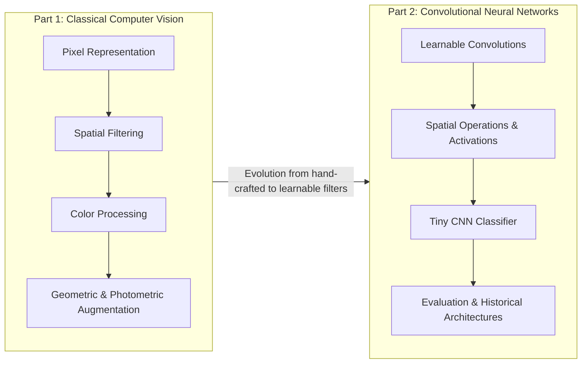

<div align="center">

# Computer Vision and CNN

### Practical Image Processing, Data Augmentation, and Convolutional Neural Network Foundations

[](https://www.python.org/)
[](https://pytorch.org/)
[](https://pytorch.org/vision/stable/)
[](https://opencv.org/)
[](https://numpy.org/)
[](https://scikit-learn.org/)
[](https://jupyter.org/)

</div>

---

## Project Overview

This repository contains the practical assignments for **Module 6**, presenting a structured, hands-on exploration that bridges traditional computer vision techniques with foundational Convolutional Neural Networks (CNNs).

Beginning with raw, pixel-level array manipulation, the curriculum progresses through mathematical kernel convolutions, color space analysis, and robust image augmentation strategies, culminating in the architectural design, spatial operations, and statistical evaluation of deep convolutional networks.

Rather than treating deep learning as an opaque black box, this work demonstrates how modern CNN architectures directly inherit and automate principles first established in classical image processing—replacing manually engineered spatial kernels with learnable filter banks.

### Core Topics Covered

* **Pixel-Level Image Representation**: Inspecting digital images as multidimensional numerical tensors.
* **Classical Spatial Filtering**: Discrete 2D convolution, horizontal and vertical edge detection, Sobel operators, and gradient magnitude estimation.
* **Smoothing & Sharpening**: Averaging blur, Gaussian blur, Canny edge detection, and unsharp masking.
* **Color Spaces & Segmentation**: RGB channel decomposition, RGB-to-HSV conversion, and chromaticity-based color masking.
* **Geometric Transformations**: Horizontal/vertical flips, affine rotations, translations, scaling, and random crops.
* **Photometric Augmentations**: Dynamic adjustments across brightness, contrast, saturation, and hue.
* **Advanced Regularization**: Blur injection, perspective distortion, and random erasing (occlusion).
* **Convolutional Layers & Feature Maps**: Filter mechanics, channel transformations, and feature map activations.
* **Spatial Operations**: Receptive field control with padding, downsampling with stride, non-linear activation via ReLU, and translation invariance through Max Pooling.
* **Tiny CNN Architecture**: End-to-end network assembly, forward propagation, classification logits, and softmax probability distributions.
* **Comprehensive Model Evaluation**: Accuracy limitations on imbalanced distributions, confusion matrices, TP/TN/FP/FN analysis, precision, recall, and F1-score.
* **CNN Architectural Evolution**: Key milestones from LeNet to AlexNet, VGG, Inception, and residual skip connections in ResNet.

---

## Objectives

1. **Understand Image Fundamentals**: Gain an intuitive and mathematical grasp of digital images as discrete 2D/3D numerical arrays.
2. **Master Classical Feature Extraction**: Implement hand-crafted convolution kernels for edge detection, noise mitigation, and image enhancement.
3. **Explore Color Geometry**: Segment regions of interest by isolating luminance from chrominance within the HSV color space.
4. **Engineer Data Augmentation Pipelines**: Build robust transformation sequences to combat model overfitting and expand dataset diversity.
5. **Demystify Convolutional Operations**: Trace how parameterized kernels compute spatial feature hierarchies from low-level edges to complex semantic representations.
6. **Implement Spatial Reductions**: Control tensor dimensionality and spatial resolution using padding, stride, and pooling operations.
7. **Construct and Forward a CNN**: Build a complete classification pipeline mapping input pixels to class prediction probabilities.
8. **Evaluate Beyond Accuracy**: Apply diagnostic metrics (precision, recall, F1, confusion matrices) to identify failure modes and class imbalances.
9. **Study Architectural Milestones**: Review historical design shifts that enabled deeper, more stable neural network training.

---

## Repository Structure

```text
Computer-Vision-CNN/
├── Module_6_Exercises_1-25_Oxford_Pet.ipynb   # Part 1: Classical CV & Data Augmentation
├── Module_6_Exercises_26-36_CIFAR10.ipynb      # Part 2: CNN Fundamentals & Model Evaluation
└── README.md                                  # Repository documentation
```

### Notebook Descriptions

* **`Module_6_Exercises_1-25_Oxford_Pet.ipynb`**: Focuses on classical image processing, filtering, color conversions, and comprehensive data augmentation pipelines using the Oxford-IIIT Pet dataset.
* **`Module_6_Exercises_26-36_CIFAR10.ipynb`**: Focuses on CNN mechanisms, convolutional layers, spatial operations, architecture assembly, and evaluation metrics using the CIFAR-10 dataset.

> **Note**: Datasets are downloaded dynamically via `torchvision` at runtime and are not stored directly within the git repository.

---

## Module 6 Breakdown

The practical coursework is divided into two distinct parts:



---

## Part 1 — Computer Vision & Image Augmentation

### Exercises 1–25
* **Primary Dataset**: Oxford-IIIT Pet
* **Focus**: Classical Image Processing, Spatial Filtering, and Data Augmentation

```
Exercises 1–7   ──▶ Image Representation & Classical Filtering
Exercises 8–10  ──▶ Color Processing & Segmentation
Exercises 11–16 ──▶ Geometric Transformations
Exercises 17–20 ──▶ Photometric Augmentation
Exercises 21–25 ──▶ Advanced Augmentation Pipelines
```

#### 1. Image Representation & Classical Filtering (Exercises 1–7)
Explores the digital representation of images as numerical pixel arrays and demonstrates how discrete 2D spatial convolution applies fixed kernels to manipulate local pixel neighborhoods.
* **Exercise 1**: Inspecting images as numerical pixel matrices, examining shape, data types, and value distributions ($[0, 255]$ vs. $[0.0, 1.0]$).
* **Exercise 2**: Vertical edge detection using dedicated differential kernels.
* **Exercise 3**: Horizontal edge detection isolating horizontal intensity gradients.
* **Exercise 4**: Sobel $X$ and $Y$ operators combined to compute directional gradients and total gradient magnitude ($G = \sqrt{G_x^2 + G_y^2}$).
* **Exercise 5**: Averaging blur (box filter) for uniform local smoothing and high-frequency noise attenuation.
* **Exercise 6**: Gaussian smoothing for weighted noise suppression followed by multi-stage Canny edge detection (gradient calculation, non-maximum suppression, hysteresis thresholding).
* **Exercise 7**: Image sharpening using high-pass filtering (Laplacian unsharp masking) to accentuate boundaries and edge transitions.

#### 2. Color Processing (Exercises 8–10)
Examines how color information is distributed across color models and demonstrates segmentation by color thresholding.
* **Exercise 8**: RGB channel decomposition, isolating Red, Green, and Blue intensity channels to analyze individual spectral contributions.
* **Exercise 9**: Converting images from RGB to HSV (Hue, Saturation, Value) color space to separate chromaticity from illumination.
* **Exercise 10**: Green and selective color masking using HSV threshold ranges to isolate foreground targets from background regions.

#### 3. Geometric Transformations (Exercises 11–16)
Applies coordinate mapping transformations that introduce spatial variance, preventing models from relying on fixed object placement.
* **Exercise 11**: Horizontal reflection (flipping) preserving semantic meaning for natural objects.
* **Exercise 12**: Vertical reflection (flipping) and its specific considerations across visual domains.
* **Exercise 13**: Affine rotation across specified angular bounds.
* **Exercise 14**: Translation (spatial shifting) along the $X$ and $Y$ axes with border handling.
* **Exercise 15**: Scaling (resizing/zooming) to simulate camera distance variations.
* **Exercise 16**: Random cropping combined with resizing to enforce scale and position invariance.

#### 4. Photometric Augmentation (Exercises 17–20)
Modifies pixel intensity distributions without altering spatial coordinates, simulating diverse environmental lighting and camera sensor responses.
* **Exercise 17**: Brightness adjustments via scalar intensity shifting.
* **Exercise 18**: Contrast scaling around mean intensity to simulate lighting condition extremes.
* **Exercise 19**: Saturation manipulation altering color vibrancy.
* **Exercise 20**: Hue shifting across the color spectrum while preserving structural lightness.

#### 5. Advanced Augmentation (Exercises 21–25)
Combines multiple transforms into unified policies and introduces occlusion techniques to enforce robust visual representations.
* **Exercise 21**: Blur augmentation simulating motion blur and out-of-focus optics.
* **Exercise 22**: Perspective distortion simulating non-orthogonal camera viewpoints.
* **Exercise 23**: Random erasing (Cutout/occlusion) forcing the model to recognize objects from partial visual cues.
* **Exercise 24**: Combined sequential augmentation pipeline chaining geometric and photometric transforms.
* **Exercise 25**: Augmentation policy design and evaluation balancing regularization strength against semantic label preservation.

---

## Part 2 — CNN Fundamentals

### Exercises 26–36
* **Primary Dataset**: CIFAR-10
* **Focus**: Convolution Mechanics, Spatial Operators, Classification Pipelines, and Performance Evaluation

```
Exercises 26–27 ──▶ Convolution Fundamentals & Feature Maps
Exercises 28–31 ──▶ Spatial Operations (Padding, Stride, ReLU, Pooling)
Exercises 32–33 ──▶ Tiny CNN Architecture & Logit Output
Exercises 34–35 ──▶ Diagnostic Evaluation & Confusion Matrix
Exercise 36     ──▶ Evolutionary Milestones of CNN Architectures
```

#### 1. Convolution Fundamentals (Exercises 26–27)
Demonstrates the shift from manually engineered filters to parameterized, learnable convolution kernels.
* **Exercise 26**: Instantiating 2D convolutional layers with learnable weights and biases in PyTorch.
* **Exercise 27**: Passing multi-channel input tensors through convolutional layers and extracting/visualizing intermediate activation feature maps.

#### 2. Spatial Operations (Exercises 28–31)
Details the mathematical operations governing feature map geometry, non-linear activation, and dimensional downsampling.
* **Exercise 28**: Padding configurations (`valid` vs. `same`) to preserve boundary spatial dimensions and prevent edge data loss.
* **Exercise 29**: Stride adjustments to regulate filter step size and control spatial downsampling.
* **Exercise 30**: Rectified Linear Unit ($\text{ReLU}(x) = \max(0, x)$) activation introducing non-linear expressive power while preserving positive gradient flow.
* **Exercise 31**: Max Pooling operations providing local translation invariance and halving spatial resolutions without introducing trainable parameters.

#### 3. CNN Architecture (Exercises 32–33)
Assembles discrete building blocks into a functional classification network.
* **Exercise 32**: Constructing a complete "Tiny CNN" architecture combining convolutional, activation, pooling, flattening, and fully connected linear layers.
* **Exercise 33**: Computing forward passes to produce raw output logits, applying the Softmax function ($\sigma(z_i) = \frac{e^{z_i}}{\sum_j e^{z_j}}$) to derive normalized class probability distributions, and identifying top-1 predictions.

#### 4. Model Evaluation (Exercises 34–35)
Examines why overall accuracy is often insufficient for model assessment and implements full diagnostic evaluation.
* **Exercise 34**: Demonstrating accuracy paradoxes on imbalanced datasets where naive majority-class predictors yield deceptively high accuracy.
* **Exercise 35**: Constructing and interpreting a multi-class Confusion Matrix; calculating True Positives (TP), True Negatives (TN), False Positives (FP), and False Negatives (FN); and deriving detailed classification metrics:
  $$\text{Precision} = \frac{\text{TP}}{\text{TP} + \text{FP}}, \quad \text{Recall} = \frac{\text{TP}}{\text{TP} + \text{FN}}, \quad \text{F1-Score} = 2 \times \frac{\text{Precision} \times \text{Recall}}{\text{Precision} + \text{Recall}}$$

#### 5. CNN Architecture Evolution (Exercise 36)
Surveys the historical milestones of deep convolutional architectures and their fundamental innovations:
* **LeNet (1998)**: Pioneer of modern conv-pool-dense pipelines for digit classification.
* **AlexNet (2012)**: Large-scale GPU acceleration, ReLU activations, and Dropout regularization.
* **VGG (2014)**: Demonstrating that stacking homogenous $3\times3$ filters achieves larger effective receptive fields with fewer parameters.
* **Inception / GoogLeNet (2014)**: Multi-scale parallel convolutions and $1\times1$ dimensionality reduction bottleneck layers.
* **ResNet (2015)**: Residual learning with identity shortcut/skip connections ($F(x) + x$) enabling the training of extremely deep networks without vanishing gradients.

---

## Datasets

The notebooks utilize two standard computer vision benchmark datasets:

| Dataset | Applied In | Channels | Resolution | Classes | Description |
| :--- | :--- | :---: | :---: | :---: | :--- |
| **Oxford-IIIT Pet** | Exercises 1–25 | 3 (RGB) | Variable | 37 | High-resolution real-world images of cats and dogs; ideal for spatial filtering, color masking, and diverse augmentation experiments. |
| **CIFAR-10** | Exercises 26–36 | 3 (RGB) | $32 \times 32$ | 10 | 60,000 small natural images across 10 mutually exclusive categories; ideal for foundational CNN prototyping, fast training cycles, and architectural exploration. |

### Why CIFAR-10 for CNN Fundamentals?
* **Standardized Dimensions**: Fixed $32 \times 32 \times 3$ dimensions simplify spatial tracking through convolution, padding, and pooling layers.
* **Low Computational Overhead**: Can be trained and forwarded rapidly on standard CPUs or free Google Colab tiers.
* **Multi-Class Complexity**: 10 diverse categories (airplane, automobile, bird, cat, deer, dog, frog, horse, ship, truck) present realistic inter-class confusion patterns suitable for confusion matrix analysis.

> **Dataset Access**: Neither dataset is committed to this git repository. Both are loaded and cached automatically via `torchvision.datasets` during notebook execution:
> ```python
> from torchvision.datasets import CIFAR10, OxfordIIITPet
> # Downloaded on demand when executing notebook cells
> ```

---

## Technologies Used

| Technology | Role & Application in Project |
| :--- | :--- |
| **Python** | Primary programming language across both notebooks. |
| **NumPy** | Fundamental array representations, manual matrix convolutions, and numerical metric computations. |
| **Pillow (PIL)** | Image I/O, format conversion, and base level geometric/photometric transformations. |
| **OpenCV (`cv2`)** | Classical computer vision operations: Sobel derivatives, Gaussian blurring, Canny edge detection, and HSV color conversions. |
| **Matplotlib** | Visualization of images, individual color channels, filter responses, feature maps, and confusion matrix heatmaps. |
| **PyTorch (`torch`, `torch.nn`)** | Implementation of convolutional layers, activation functions, pooling operators, tensor transformations, and the Tiny CNN model. |
| **TorchVision** | Dataset access (`CIFAR10`, `OxfordIIITPet`) and PyTorch-native augmentation transform pipelines (`torchvision.transforms`). |
| **Scikit-learn** | Diagnostic classification reporting, confusion matrix computation, and metric derivation (precision, recall, F1). |
| **Jupyter Notebook / Google Colab** | Interactive execution environment supporting markdown documentation and step-by-step code outputs. |

---

## How to Run

### Option 1: Google Colab (Recommended)

1. Open [Google Colab](https://colab.research.google.com/).
2. Upload the desired notebook:
   * `Module_6_Exercises_1-25_Oxford_Pet.ipynb` for Classical CV & Data Augmentation
   * `Module_6_Exercises_26-36_CIFAR10.ipynb` for CNN Fundamentals & Evaluation
3. Ensure runtime is set (CPU is sufficient; GPU can be selected under **Runtime > Change runtime type**).
4. Run cells sequentially from top to bottom.
5. Required datasets (`Oxford-IIIT Pet` and `CIFAR-10`) will automatically download via `torchvision` into the Colab runtime environment.

### Option 2: Local Jupyter Notebook

1. **Clone the repository**:
   ```bash
   git clone https://github.com/Shailesh-S-04/Computer-Vision-FWC.git
   cd Computer-Vision-FWC
   ```

2. **Create and activate a virtual environment** (optional but recommended):
   ```bash
   python -m venv venv
   # On Windows:
   venv\Scripts\activate
   # On macOS/Linux:
   source venv/bin/activate
   ```

3. **Install dependencies**:
   ```bash
   pip install numpy pillow opencv-python matplotlib scikit-learn torch torchvision jupyter
   ```

4. **Launch Jupyter Notebook**:
   ```bash
   jupyter notebook
   ```

5. Open either `Module_6_Exercises_1-25_Oxford_Pet.ipynb` or `Module_6_Exercises_26-36_CIFAR10.ipynb` and execute the cells.

---

## Key Concepts Learned

* **Duality of Filters**: Classical CV requires manual mathematical design of kernels (e.g., Sobel for edges, Gaussian for smoothing). In contrast, CNNs initialize random weights and automatically learn optimal task-specific kernels through backpropagation.
* **Color Representation Nuances**: While RGB mimics human retinal photoreceptors, it bundles chromaticity and intensity together. Converting to HSV decouples color from illumination, making color segmentation robust against lighting variations.
* **Data Augmentation as Regularization**: Synthetic variation (rotations, flips, crops, photometric shifts, cutouts) expands effective training data volume and discourages networks from memorizing spurious spatial correlations.
* **Spatial Arithmetic in CNNs**: Given an input dimension $W$, filter size $K$, padding $P$, and stride $S$, the output dimension is governed by:
  $$W_{\text{out}} = \left\lfloor \frac{W - K + 2P}{S} \right\rfloor + 1$$
* **Activation and Downsampling**: Non-linear activations like ReLU prevent network collapse into trivial linear transformations, while pooling reduces computational cost and introduces local spatial invariance.
* **Evaluation Integrity**: High raw accuracy can be entirely deceptive on class-skewed datasets. Precision, recall, and F1-score provide the true diagnostic view required for reliable real-world deployment.

---

## Practical Applications

The techniques implemented in this repository form the foundational pipeline for numerous real-world computer vision systems:

* **Autonomous Driving**: Edge detection and color masking assist in lane boundary tracking; CNN feature extraction detects vehicles, pedestrians, and traffic signs under variable weather and lighting conditions.
* **Medical Image Analysis**: Unsharp masking and contrast normalization enhance microscopic tissue and radiography scans; CNN classification flags anomalies in X-rays, MRIs, and histopathology slides.
* **Industrial Automated Inspection**: Color segmentation and geometric alignment verify component positioning on assembly lines; edge operators identify surface cracks and manufacturing defects.
* **Agricultural & Environmental Monitoring**: HSV masking segments vegetation coverage and crop canopy; CNN classifiers identify plant diseases and weed species from aerial drone imagery.

---

## Limitations / Learning Notes

* **Educational Scope**: This repository represents foundational coursework for **Module 6**. It is focused on demonstrating core mechanics and principles rather than competing on production benchmarks.
* **Model Scale**: The "Tiny CNN" implemented in Exercises 32–33 is intentionally lightweight and designed for rapid prototyping, inspectability, and clear pedagogical demonstration of forward passes.
* **No Pre-Trained Weights**: Models in these foundational exercises are trained or initialized from scratch to inspect low-level mechanics. Production systems typically utilize deep pre-trained backbones (e.g., ResNet-50, EfficientNet, Vision Transformers) fine-tuned via transfer learning.
* **Augmentation Heuristics**: Transforms in Part 1 are demonstrated with visually distinct parameters to clearly highlight their individual effects. In competitive production pipelines, hyperparameter search (e.g., RandAugment, AutoAugment) is typically employed to select optimal policy strengths.

---

## Author

* **Shailesh S** ([@Shailesh-S-04](https://github.com/Shailesh-S-04))

---

## License

This repository is maintained for educational and coursework reference purposes. All code and documentation are available for study and academic use under the [MIT License](https://opensource.org/licenses/MIT).